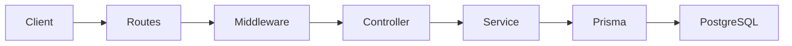

# Auditly

## TL;DR
Auditly is a **production-grade TypeScript backend** designed for **multi-tenant applications**, focusing on **secure, scalable architecture**, and providing features like **JWT authentication**, **RBAC**, and **audit logging**.

> Focused on ownership-based RBAC, strict multi-tenancy, and auditability — not CRUD demos.

This repository is intended to be read like a **system design walkthrough**, not a feature checklist.

## Table of Contents

- [Key Features](#key-features)
- [Why Auditly Exists](#why-auditly-exists)
- [Key Engineering Decisions](#key-engineering-decisions)
- [Architecture Overview](#architecture-overview)
- [Multi-Tenant & Security Model](#multi-tenant--security-model)
- [Authentication & Authorization](#authentication--authorization)
- [Request Lifecycle & Middleware Stack](#request-lifecycle--middleware-stack)
- [Audit Logging](#audit-logging)
- [Technology Choices & Rationale](#technology-choices--rationale)
- [Testing Strategy](#testing-strategy)
- [Prerequisites](#prerequisites)
- [Getting Started](#getting-started)
- [Project Structure](#project-structure)
- [Live Demo & API Docs](#live-demo--api-docs)
- [Monitoring & Logging (High-Level)](#monitoring--logging-high-level)
- [CI/CD & Automation](#cicd--automation)
- [Roadmap](#roadmap)
- [Who This Project Is For](#who-this-project-is-for)
- [About the Author](#about-the-author)
- [License](#license)


## Key Features

- **Multi-tenant aware API** with strict tenant isolation  
- **JWT-based authentication** with role-based access control (RBAC)  
- **Comprehensive audit logging** and request tracing for accountability  
- **Production-style project structure** built for maintainability and scale

## Why Auditly Exists

Many backend tutorials focus only on basic CRUD operations, skipping real-world system design.  
Production backends require more than just functional endpoints:

- **Tenant isolation** to prevent data leaks  
- **Full traceability** to track actions and events  
- **Predictable request flow** for debugging, scaling, and audits

**Auditly** explores how production systems are **built for long-term maintainability**, emphasizing **structure, safety**, and **avoidance of shortcuts**.

### Core Principles

- **Clear separation of concerns** across layers  
- **Security-first** defaults for safer systems  
- **Observability from day one** (not after the fact)

## What This Project Demonstrates
- Ownership-based RBAC tied to company lifecycle
- Tenant isolation enforced at auth, service, and data layers
- Service-level audit logging for full traceability

## Key Engineering Decisions

- **Introduced ownership-based RBAC (OWNER / ADMIN / USER)**  
  Company lifecycle tied to OWNER role → clear authority boundaries per tenant.

- **Designed strict multi-tenant isolation**  
  companyId derived only from JWT and enforced at service and data layers.

- **Layered architecture over monolithic routes**  
  Business logic isolated from HTTP → testable, predictable request flow.

- **Authorization enforced at service boundaries**  
  Prevents privilege escalation and keeps domain rules centralized.

- **Audit logs as a first-class feature**  
  Service-level logging for traceability, debugging, and accountability.


## Architecture Overview

Auditly uses an **explicit, layered request pipeline** — every step is visible, enforceable, and testable.

### High-Level Request Flow

Client
→ Routes
→ Middleware
→ Controller
→ Service
→ Prisma ORM
→ PostgreSQL

### Architecture Diagram



## Design Goals & Non-Goals

### Design Goals

- Explicit layering with clear ownership and single responsibility
- Consistent company isolation enforced across services and data access
- End-to-end traceability for audits, debugging, and operations
- Security and validation at system boundaries, not scattered logic

### Non-Goals

- Not a framework or abstraction layer
- Not optimized for rapid MVP delivery 
- Not a feature-complete SaaS
- Frontend concerns are intentionally excluded

## Layer Responsibilities

Each layer has a **single, clear purpose** no overlap, no hidden logic.

- **Routes**  
  Define endpoints and wire requests into the system
- **Middleware**  
  Handle cross-cutting concerns (auth, context, tracing)
- **Controllers**  
  Manage HTTP input and output only
- **Services**  
  Own business logic and authorization rules
- **Prisma**  
  Provide scoped, type-safe data access via a shared client managed at app startup
- **PostgreSQL**  
  Ensure durable, reliable persistence
- **Utils**  
  Contain stateless helpers and shared utilities

---

## Why This Structure

- **Testable** — business logic is isolated from HTTP and persistence  
- **Predictable** — every request follows a single, explicit path  
- **Scalable** — complexity grows without collapsing boundaries  

This architecture favors **clarity and operational discipline** over convenience.

## Multi-Tenant & Security Model
Built for **strict company isolation** with clear, enforceable authorization rules.

---

### 🏷 Company Identification

- **Company derived from JWT**
  - `companyId` is embedded in the JWT at login
  - Never accepted from request body, params, or headers

- **Propagated through request lifecycle**
  - Extracted once in auth middleware
  - Attached to request context and passed to services
  - No re-parsing or duplication

---

## Isolation Enforcement

- **Authorization middleware**
  - Validates JWT
  - Extracts `companyId` and role

- **Service-layer guards**
  - Services require `companyId` explicitly
  - Business rules enforced close to domain logic

- **Prisma query scoping**
  - Every query scoped with `where: { companyId }`
  - No unscoped access to company-owned data

---

### Authorization Boundaries

- **OWNER** — full company control
- **ADMIN** — operational access
- **USER** — limited, permission-based access

---

### 🛡 Route-Level Protection

- Routes declare required roles
- Middleware blocks unauthorized access early
- Controllers remain thin and focused

---

### Common Pitfalls Avoided

- Cross-company data leaks
- Trusting client-provided company IDs
- Fat controllers with mixed concerns

---

**Result:**  
A clean, defense-in-depth multi-company security model that’s easy to reason about and hard to break.


## Authentication & Authorization

Built for **clear flows, security, and auditability**, not framework tricks.

---

### 🔐 JWT & Refresh Tokens

- Short-lived **access tokens**, long-lived **refresh tokens**  
- Refresh token issues new access token on expiry  
- Expiry enforced server-side

---

### 🔁 Token Lifecycle

- Issued at login after credential verification  
- Rotated on refresh to reduce reuse risk  
- Revoked on logout or suspicious activity

---

### 🔑 Passwords

- **Never stored in plain text**, hashed securely  
- Comparison only against hashed values

---

### ✉️ Email Verification

- Accounts start unverified  
- One-time, time-bound verification token  
- Required before sensitive actions

---

### 🧭 Role-Based Access Control

- Roles in JWT (`OWNER`, `ADMIN`, `USER`)
- Enforced via middleware & service guards  
- Routes declare required roles explicitly  
- Centralized, predictable authorization

---

**Result:**  
A **secure, auditable auth system** that’s easy to reason about and ready for production.

## Request Lifecycle & Middleware Stack

- **Request ID**  
  Generated at the edge and carried through logs, audits, and errors for easy tracing.

- **Security Headers**  
  Applied globally to reduce common web attack vectors.

- **Rate Limiting**  
  Throttles abusive or accidental high-traffic clients early.

- **Auth Validation**  
  JWT verified once; user, role, and company context extracted up front.

- **Request Validation (Zod)**  
  Body, params, and query validated before any business logic runs.

- **Controller Execution**  
  Controllers stay thin — HTTP in, service call out.

- **Audit Logging**  
  Sensitive actions recorded with actor, company, and request ID.

- **Centralized Error Handling**  
  Single error exit with consistent, safe responses.

---

**Result:**  
A production-aware request flow that’s easy to trace, hard to abuse, and simple to maintain.

## Audit Logging

Core domain actions are recorded in a dedicated **AuditLog** table for traceability and compliance.

- **userId**: actor (nullable for system actions)
- **companyId**: company context
- **action**: operation performed
- **entity / entityId**: affected resource
- **metadata**: extensible JSON payload
- **createdAt**: event timestamp

Audit events are written at the **service layer**, not controllers, so logging stays consistent and independent of HTTP concerns.

Metrics (Prometheus/Grafana) exist only as **scaffolding** and are not wired yet, logging is the priority, metrics come later.

## Technology Choices & Rationale

| Technology | Why |
|----------|-----|
| **TypeScript** | Compile-time safety, fewer runtime bugs |
| **Express** | Explicit control over request flow |
| **Prisma** | Typed schema, safe queries, migrations |
| **Zod** | Runtime validation at system boundaries |
| **PostgreSQL** | Strong relational integrity |
| **Docker** | Reproducible dev and CI environments |
| **Jest** | Confidence through fast, focused tests |
| **GitHub Actions** | Automated checks on every change |

Built for clarity, safety, and long-term maintainability, no magic, no lock-in.

## Testing Strategy

- **E2E-first approach**
  - Covers auth flows, RBAC, company isolation, and middleware behavior

- **Realistic execution**
  - Tests run against an isolated test database
  - Simulate real client requests, not mocked internals

- **Cross-layer validation**
  - Verifies correctness across auth → service → database
  - Catches integration bugs early

- **Intentional trade-off**
  - Unit tests (e.g. WebSocket handlers, pure utils) are deferred
  - Priority is stabilizing core system flows first

Focused on confidence where it matters most in production.

## Prerequisites

- Node.js (v18 or higher)
- PostgreSQL (v14.0 or higher)
- Docker and Docker Compose (optional)

## Getting Started

### Local Development

1. Clone the repository:

```bash
git clone https://github.com/keshavagrawal18/auditly.git
cd auditly
```

2. Install dependencies:

```bash
npm install
```

3. Set up environment variables:

```bash
cp .env.example .env
```

4. Set up the database:

```bash
npm run migrate:dev
npm run seed:dev
```

5. Start the development server:

```bash
npm run dev
```

## Project Structure

```
├── src/
│   ├── __tests__/        # Test files
│   ├── @types/          # TypeScript type definitions
│   ├── config/          # Configuration files
│   │   └── database.ts  # Prisma client initialization & lifecycle management
│   ├── controllers/     # Route controllers
│   ├── middleware/      # Express middleware
│   ├── routes/          # API routes
│   ├── services/        # Business logic
│   ├── utils/           # Utility functions
│   ├── validators/      # Request validation schemas
│   ├── app.ts          # Express app setup
│   └── index.ts        # Application entry point
├── prisma/             # Prisma schema and migrations
├── requests/           # REST client files
└── docker/            # Docker configuration files
```


## Live Demo & API Docs

Explore Auditly in action with a live deployment and interactive API documentation.

- **API Base URL (Railway):**  
  https://auditly-backend-production.up.railway.app/

- **Swagger API Docs:**  
  https://auditly-backend-production.up.railway.app/api-docs

- **Optional Test Credentials:**  
  - Email: demo@auditly.dev  
  - Password: Demo@123

**Purpose:** instant credibility and hands-on access to evaluate the architecture, security flows, and API design.


---

## Monitoring & Logging (High-Level)

- Audit logs for all key actions
- Request IDs to trace operations end-to-end
- Basic Prometheus metrics and logging infrastructure

> Detailed monitoring and dashboards are planned for later iterations — the focus here is **architecture and observability patterns**.

## CI/CD & Automation

- **GitHub Actions on PRs** — automatic checks on every change  
- **Test pipeline** — install → migrate → test  
- **Docker builds** — clean, production-like validation  
- **Fail fast** — catch breakages before merge

Built to protect `main` without slowing development.


## Roadmap

Planned improvements as the system grows:

- **Policy-based permissions** — more flexible access control than roles
- **Event-driven audit logs** — scalable, async logging
- **Distributed tracing** — track requests across services
- **Redis caching** — faster responses, less DB load
- **Read replicas** — scale reads without touching writes

Focused on real scaling needs, not premature complexity.

## Who This Project Is For

- **Backend engineers** — looking for clean, production-grade patterns  
- **System design learners** — wanting to see theory applied in code  
- **Interview preparation** — real talking points, not toy examples  
- **Reference architecture** — a practical baseline for future projects

Built to learn from, talk about, and build on.

## About the Author

**Keshav Agrawal**  
Full Stack Developer (Backend-focused)

- **GitHub:** https://github.com/keshavagrawal18  
- **LinkedIn:** https://www.linkedin.com/in/keshav-agrawal-ka  

I build production-oriented backend systems with a strong focus on **architecture, security, and real-world engineering trade-offs**.  

Auditly reflects how I think about designing scalable APIs, enforcing clear access boundaries, and treating **observability as a first-class concern**, not an afterthought.


## License

This project is licensed under the MIT License - see the [LICENSE](LICENSE) file for details.
